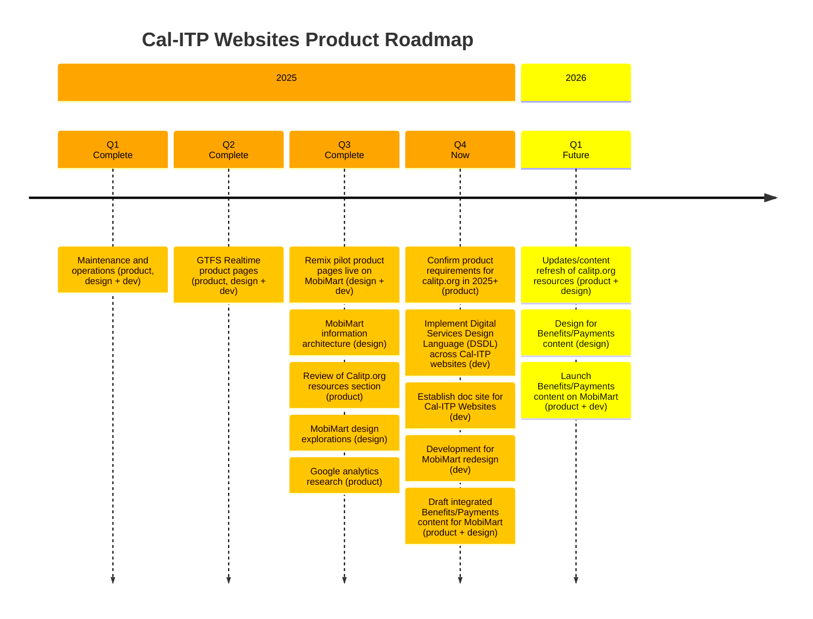

# Cal-ITP websites

Our product roadmap captures what we’re currently building, what we’ve built, and what we plan to build in the future. We update it at the end of each quarter or when priorities change.

